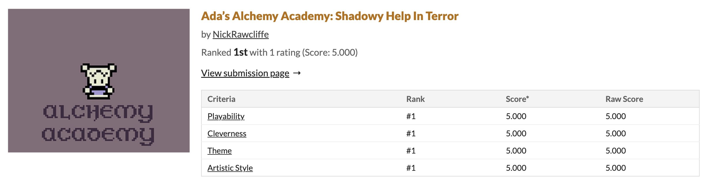
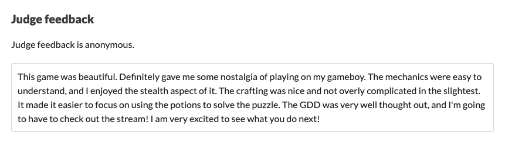

# Ada's Alchemy Academy: Shadowy Help In Terror

## Playable Builds & Source Code

This game has two playable builds. A GameBoy ROM version that is playable on a real GameBoy via a flash cart or via an emulator. It also has a browser version. As for source code the original GB Studio project is also available.

::: tip
- Play browser version [here](./play_ada.md)
- Download the ROM from [GitHub](https://github.com/OwlfaceGames/owlface_archive/releases)
- The GB Studio project can be found [here](https://github.com/OwlfaceGames/owlface_archive/tree/master/source_code/adas_alchemy_academy_shadowy_help_in_terror/game)
- See [controls](#controls) first.
:::

## Score

I entered this jam to better learn a new engine and to challenge myself.

It was never part of the plan to actually score well. The success I had in this jam was both unexpected and inspiring. As someone who is entirely self tought and who has professionally designed, programmed and made a bunch of music and sound effects for games I have never really been a pixel artist.

The high score and feedback I got on the art is something that really meant a lot and that I was extremely proud of. It felt like I was finally making progress as a pixel artist. Consequently this project inspired the aesthetic and dev pipeline I created for the game I am working on today. Heavily inspired by the GameBoy and GB Studio.

## Details

This game was made a part of a game jam I entered in 2024. The themes were "Alchemy" and "Shadows". I took the themes extremely literally and made a game where you crafted potions that created shadows.

The coolest thing about this game is that it is an actual gameboy game that I got running on an actual gameboy at the end. Made in GB Studio.

I also remember that the jam was two weeks long but I decided to do it in one for the extra challenge.

::: info
- **Playable:** Yes 
- **Source Code:** Yes
- **Date:** July 2024
- **Project Type:** Jam Game
- **Platforms:** Game Boy, Browser
- **Engine:**  GB Studio
- **Role:** Everything 
:::

## Original Text From The Itch.io Page 

Hey, I'm Nick. I made this game for PirateSoftware Game Jam 15. Except for the extra challenge I made it in 7 days instead of 14. It's also a gameboy game I made in GB Studio that can run on a real gameboy. See video for example of it running on a GameBoy.

You play as Ada an aspiring alchemist at the Alchemy Academy. However unfortunately Ada's studies have been cut short via an invasion of goblins. Ada must find ingredients to craft potions that when thrown in the right spot will create shadows that will help you sneak around and escape the goblin threat.

Runs on mobile BTW.
Theme (Shadows & Alchemy)

This is literally a game about brewing potions that make shadows.

## GameBoy Version

Here is it running on an actual gameboy.

## Design Doc

  <iframe 
    style="width: 100%; height: 100%; border: none;"
    src="/design_docs/ada.pdf"
    type="application/pdf">
    
Your browser doesn't support PDF embedding. <a href="/path-to-your-pdf.pdf">Download the PDF</a> instead.

  </iframe>

As part of this jam you actually had to create a design doc that would effect your score. So, here is the actual PDF.

## GameBoy Version Footage

  <iframe 
    style="position: absolute; top: 0; left: 0; width: 100%; height: 100%; border: none;"
    src="https://www.youtube-nocookie.com/embed/zoYrRpHVWuM "
    allowfullscreen>
  </iframe>

Me celebrating the completion of the game jam by proving it runs on an actual GameBoy.

## Full Playthrough

  <iframe 
    style="position: absolute; top: 0; left: 0; width: 100%; height: 100%; border: none;"
    src="https://www.youtube-nocookie.com/embed/i_eLPV0bfgU "
    allowfullscreen>
  </iframe>

If you'd rather just watch footage to check the game out rather than playing you can.

## Controls

### PC

Up - Up Arrow / W

Down - Down Arrow / S

Left - Left Arrow / A

Right - Right Arrow / D

A - Alt / Z / J

B - Ctrl / K / X

Start - Enter

Select - Shift

### GameBoy

Up 

Down 

Left 

Right 

A

B

Start

Select 
