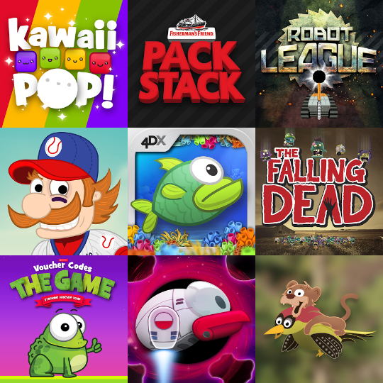
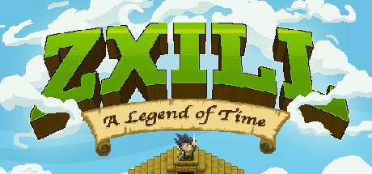
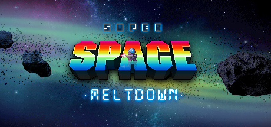

# Archived Owlface Games

## Game List

### Ada’s Alchemy Academy: Shadowy Help In Terror (July 2024)

This game was made a part of a game jam I entered in 2024. The themes were "Alchemy" and "Shadows". I took the themes extremely literally and made a game where you crafted potions that created shadows.

The coolest thing about this game is that it is an actual gameboy game that I got running on an actual gameboy at the end. Made in GB Studio.

I also remember that the jam was two weeks long but I decided to do it in one for the extra challenge.

::: details
- **Playable:** Yes 
- **Source Code:** Yes
- **Date:** July 2024
- **Project Type:** Jam Game
- **Platforms:** Game Boy, Browser
- **Engine:**  GB Studio
- **Role:** Everything 
:::

::: tip
**You can find the game page [here](./ada).**
:::

### Disable Enemies To Reveal Enemies (Est. 2016)

This game was made as part of a game jam in a day. The idea of the jam was that you could pick an episode title of a certain podcast and have that be the theme for your game. This is why I entered because I thought it was a really interesting idea as it made for some very weird and wonderful themes. 

That is why the game is so bizarre. I remember that it also turned out to be a really hard game. I also remember that one way I was able to make the game in such a short period of time was by using part of the open source Spelunky level generation code plus some platformer asset pack I got off the GameMaker store then just tweak them and thread them together to fit my idea.

It's pretty rough but considering how quickly it was made I think it's pretty cool.

::: details
- **Playable:** Yes 
- **Source Code:** No
- **Date:** Est. 2016
- **Project Type:** Jam Game
- **Platforms:** Windows
- **Engine:** GameMaker 
- **Role:** Everything (except open source code & asset pack)
:::

::: tip
**You can find the game page [here](./disable.md).**
:::

### Various Commercial Games (Est. 2013 - 2016)

For this period of time I was employed at a company making games full time. My job title was, "Game Development Manager" which was another way of saying I wore a lot of hats. It was essentially a senior dev role but I also got to do a bunch of other things. I was the lead programmer and designer on many projects and I also made most of the sound effects and music the company was making at the time.

It was a small company and the strategy was basically to make as many small games as possible and see what stuck. During this time I made so many games that I lost track. There are definitely some that I don't even remember.

They were mostly for IOS, Android and browsers. I also got to help other devs with thier code. Helping them with optimisation and helping them solve any problems they were having at the time. I also would vet any game ideas that were on the table at the time.

Nothing we made really worked out commercially as far as I know but this job gave me such an insane amount of experience that I cherish to this day. Even if by the end of the job I was completely burnt out.

In the image above I remember that I designed and programmed every game on the top row. I think maybe also the first on the second row. And. I believe I made all the music and sound effects for all the games.

Obviously I do not own this code. Most if not all of the games are no longer playable as it was so long ago. But I thought it was worth including as this period makes up most of the games I have worked on.

::: details
- **Playable:** No
- **Source Code:** No
- **Date:** Est. 2013 - 2016
- **Project Type:** Commercial Releases
- **Platforms:** Windows, IOS, Android, Browsers
- **Engine:** GameMaker 
- **Role:** Senior Dev, Design, Programming, Sound Design, Music
:::

::: info
There are no game pages for any of these games as the code is not owned by me and they are no longer playable.
:::

### Zxill: A Legend of Time (Est. 2013 - 2016)

While working at the job I mentioned in the previous section we also made a couple of games that we were able to get on to steam via greenlight and release into early access.

This was one of those games. This game was my idea, my design and I was the only programmer on the project. Plus I got to write all the music, create all the sound effects and write any story and dialogue.

The idea was to try and make a retro RPG with a unique battle system that revolved around pulling off fighting game style combos. It fell short in the end mostly just due to it never being finished and admittedly due to my own inexperience. After I stopped working there I don't think development continued. However, I still think if we kept going it could have been something cool.

Nonetheless it does appear to still be up on steam. I do not recommend buying it as it is an unfinished and abandoned game. But in the interest of transparency, here it is.

::: details
- **Playable:** Yes
- **Source Code:** No
- **Date:** Est. 2013 - 2016
- **Project Type:** Commercial Release
- **Platforms:** Windows
- **Engine:** GameMaker 
- **Role:** Senior Dev, Design, Programming, Sound Design, Music
:::

::: info
There is no game page for this game as I do not own the code nor do I have the right to distribute it.
:::

::: warning
Buying this game is not recommended. It is unfinished and abandoned.
:::

::: tip
This game is playable on steam [here](https://store.steampowered.com/app/397830/Zxill_A_Legend_of_Time/).
:::

### Super Space Meltdown (Est. 2013 - 2016)

Pretty much everything I said about the last project you could also say about this project.

However it was a lot more rushed and I think ultimately less finished. The idea was to try and combine ARPG gameplay with click mechanics where you had to keep clicking something to fire your gun

Not as cool of an idea as the previous project but at least it was still kind of interesting.

Alas it suffered the same fate and is now long abandoned. However it is also still up on steam.

::: details
- **Playable:** Yes
- **Source Code:** No
- **Date:** Est. 2013 - 2016
- **Project Type:** Commercial Release
- **Platforms:** Windows
- **Engine:** GameMaker 
- **Role:** Senior Dev, Design, Programming, Sound Design, Music
:::

::: info
There is no game page for this game as I do not own the code nor do I have the right to distribute it.
:::

::: warning
Buying this game is not recommended. It is unfinished and abandoned.
:::

::: tip
This game is playable on steam [here](https://store.steampowered.com/app/388500/Super_Space_Meltdown/).
:::

### Medieval Dungeon Throwdown (Est. 2013)

This is one of the first games I ever made. It was made specifically as a portfolio piece at the time to show potential employers. It was made in 24 hours right before a job application, which was successful.

It is a little arcade style mini game that for whatever reason I decided should have a film grain effect complete with vinyl crackle. Considering it was so early on I think it's kinda of interesting that it does have a cohesive aesthetic.

This game was probably made less than twelve months after I starting trying to teach myself how to make games.

::: details
- **Playable:** Yes 
- **Source Code:** No
- **Date:** Est. 2013
- **Project Type:** Portfolio Piece
- **Platforms:** Windows
- **Engine:** GameMaker 
- **Role:** Everything 
:::

::: tip
**You can find the game page [here](./throwdown.md).**
:::

### Save The Dwarf (Est. 2013)

This game was also one of the first games I ever made, much like the last one. However the difference is that this was a project that I had been working on in my spare time that as a new dev I was hoping to eventually attempt to get on steam via steam greenlight. Back when it wasn't so easy to publish games on steam.

Anyway this was planned to be a long term project at the time but when I got a potential job offer I decided to scale it down and try and condense it into a short, rough but still relatively whole small game.

That way I'd have something that felt more finished for my portfolio. In the end it only ever became a portfolio piece, after finding employment.

::: details
- **Playable:** Yes 
- **Source Code:** No
- **Date:** Est. 2013
- **Project Type:** Portfolio Piece
- **Platforms:** Windows
- **Engine:** GameMaker 
- **Role:** Everything 
:::

::: tip
**You can find the game page [here](./dwarf.md).**
:::

### Space Miners: Incident Red Fortune (Est. 2012)

This is the first game I ever made. And I have to say when I tested this game for the creation of this archive, I expected it to be really bad. And obviously it is.

However I was pleasantly surprised with how many interesting design ideas there are despite all the jank and awful graphics.

It is a puzzle platformer with some relatively interesting mechanics.

I never studied, game development or computer science or anything like that. When I graduated from university I had a bachelors and a masters in music tech. In my masters we were taught the very basics of python for some basic scripting.

When I say basic, I mean basic. We only really learnt the basic syntax. However at the time I never thought I'd ever be able to program and it was that experience that made me think maybe, just maybe I could.

My music background made creating music and sound effects easy but pixel art was something I had zero understanding of and back in 2011/2012 the world was a very different place.

I found it difficult to find good tutorials for anything really. All these years later I'm making my own game in C and programming has become my favourite part of the process. I try to never to be an expert and assume that I have something to learn from everyone as even if they can only tell you what you already know you can never learn the basics enough and if it turns out they're a fountain of knowledge, you're waiting with open ears ready to learn instead of closing off that opportunity to improve.

Almost every time I sit down at the computer to start a new project I learn something new and I think that is what I love so much about game development. That and being able to express my creativity in an unparalleled way. Even if ninety percent of this archive is trash.

::: details
- **Playable:** Yes 
- **Source Code:** No
- **Date:** Est. 2012
- **Project Type:** Portfolio Piece
- **Platforms:** Windows
- **Engine:** GameMaker 
- **Role:** Everything 
:::

::: tip
**You can find the game page [here](./miners.md).**
:::
